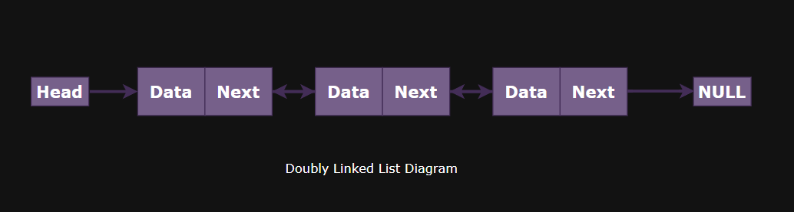

Introduction :

    A Doubly Linked List (DLL) is a linear data structure in which:
      -Each element (node) contains:
        -Data
        -A reference (pointer) to the next node
        -A reference (pointer) to the previous node
      -The first node’s previous pointer is null
      -The last node’s next pointer is null
      -Traversal is possible in both directions (forward and backward)
      -Memory is not contiguous
      -Nodes are dynamically allocated and connected using two links

Basic Structure :

