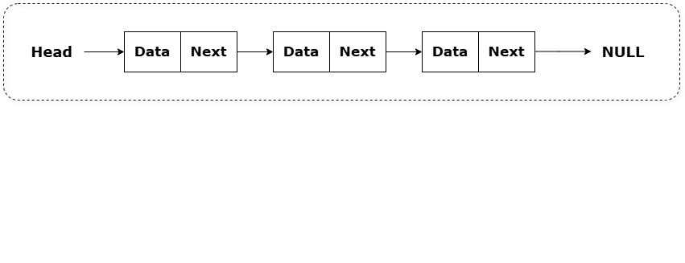

SINGLY LINKED LIST :

Introduction :

    A Singly Linked List (SLL) is a linear data structure where:
    -Each element (node) stores:
        -Data
        -A reference (pointer) to the next node
    -The last node points to null
    -Traversal is only possible in one direction (forward)
    -Unlike arrays, memory is not contiguous.
    -Each node is dynamically allocated and linked using pointers.

Basic Structure :

Real-World Examples (With Technical Accuracy) :

    🌐 1️⃣ Forward Navigation (Simplified Browser Model)
        In a simplified model of a browser (like Google Chrome), if you only allow forward navigation, it behaves like a Singly Linked List.
        Concept :
            -Each webpage stores:
                -URL (data)
                -Reference to next visited page
        Diagram :
        
        Before visiting new page :
            [Google] → [YouTube] → [GitHub] → null
        
        After visiting "StackOverflow":
            [Google] → [YouTube] → [GitHub] → [StackOverflow] → null
            
        Structure Representation :
                +---------+      +----------+      +---------+
                | Google  | ---> | YouTube  | ---> | GitHub  | ---> null
                +---------+      +----------+      +---------+
                
        ⚠ Note :
            -Real browsers use Doubly Linked List because back navigation is required.
            -This is a simplified forward-only representation.
    
    🧭 2️⃣ GPS Route Path (Sequential Directions)
        -In systems like Google Maps, the final computed route can be represented as a sequence of steps.
        -Internally it uses graphs, but once the shortest path is computed, it becomes a linear sequence.
        Example Route  :
            Start → Signal → Bridge → Mall → Destination
        
        Diagram  :
        
                                        [Start]
                                           ↓
                                        [Signal]
                                           ↓
                                        [Bridge]
                                           ↓
                                        [Mall]
                                           ↓
                                        [Destination]
                                           ↓
                                          null
        
        Or pointer form:
            [Start | next] → [Signal | next] → [Bridge | next] → null
    
        -Each node points only to the next location.
    
    ⛓ 3️⃣ Blockchain Structure (Conceptual Similarity)
    
        In Blockchain:
            Each block contains:
                -Transaction data
                -Hash of previous block
                -This forms a one-direction chain.
        
        Diagram :
                [Block 1] → [Block 2] → [Block 3] → null
        
        Expanded view:
                
                +-----------+      +-----------+      +-----------+
                | Data      | ---> | Data      | ---> | Data      |
                | PrevHash  |      | PrevHash  |      | PrevHash  |
                +-----------+      +-----------+      +-----------+
        
        Difference:  
            -Blockchain uses cryptographic hashing.            
            -SLL uses memory references. 
            -But structurally, both are forward-linked chains.
    
    📦 4️⃣ Music Playlist (Forward Only Mode)
        -If a playlist allows only “Next” (no previous), it behaves like an SLL.
            [Song1] → [Song2] → [Song3] → null
        -Each song stores:
            -Song data
            -Pointer to next song

Advantages of Singly Linked List

    1️⃣ Dynamic Size
        -Can grow or shrink at runtime.
        -No need to predefine size (unlike arrays).
    
    2️⃣ Efficient Insertion/Deletion at Beginning
        -O(1) time complexity.
        -Just update head pointer.
    
    3️⃣ No Memory Wastage Due to Capacity
        -Allocates memory per node.
        -No unused reserved space.
    
    4️⃣ Easy Implementation
        -Simpler than doubly or circular linked lists.

Drawbacks of Singly Linked List

    1️⃣ No Random Access
        -Cannot access element by index directly.
        -Access takes O(n).
        -Unlike arrays:
            arr[5] → O(1)
        
        -In SLL:  
            Traverse from head → O(n)
            
    2️⃣ One-Directional Traversal
        -Cannot move backward.
        -Must start from head again.
    
    3️⃣ Extra Memory Overhead    
        -Each node stores: 
            -Data
            -Next pointer
        -Compared to array (data only), this increases memory usage.
    
    4️⃣ Poor Cache Performance
        Because memory is non-contiguous:
            -Cache locality is weak
            -Slower than arrays in practice

When to Use SLL?

    Use Singly Linked List when:
        -Frequent insertions/deletions at beginning
        -Size is unpredictable
        -Sequential access is acceptable
    
    Avoid it when:
        -Random access is needed
        -Backward traversal is required
        -Performance-critical indexing is required
    

Singly Linked List Implementation (Java)

    -It covers fundamental operations required for understanding Linked List concepts.
        Features Implemented
            Insertion Operations
                - Insert at Beginning
                - Insert at End
                - Insert at Specific Position (0-based indexing)
        
            Deletion Operations
                - Delete from Beginning
                - Delete from End
                - Delete at Specific Position
        
            Utility Operations
                - Count number of nodes
                - Search for a value
                - Reverse the linked list (iterative)
                - Find middle node using Slow & Fast Pointer
                - Display list

    
