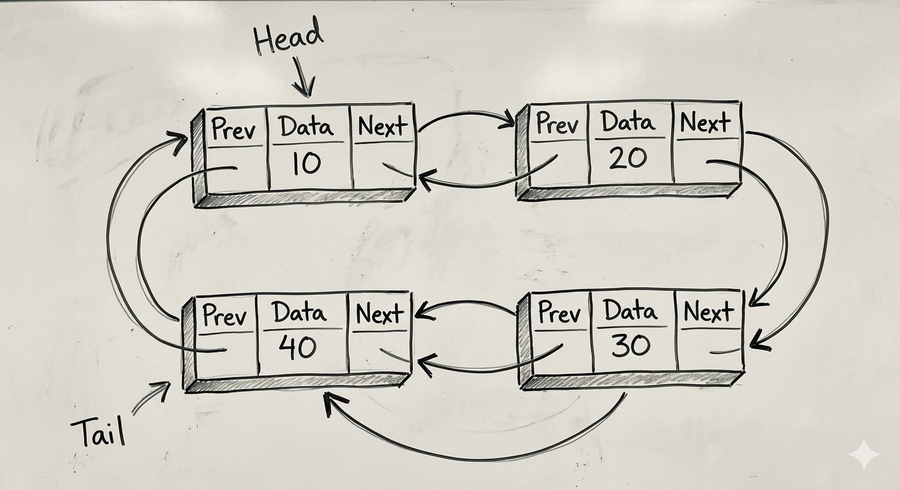

<h2> Circular Linked List </h2>
<h4>Introduction :</h4>

    A Circular Linked List (CLL) is a linear data structure in which:
      -Each element (node) contains:
        -Data
        -A reference (pointer) to the next node.
      -The last node’s next pointer points back to the first node, forming a circular structure.
      -There is no NULL pointer at the end of the list.
      -The head node acts as the starting point of the list.
      -Traversal continues until the pointer reaches the head node again.
      -Memory is not contiguous.
      -Nodes are dynamically allocated and connected using a single link (next pointer).

<h4>Basic Structure :</h4>

Diagram for Circular Singly Linked List :
 
 

 
Diagram for Circular Singly Linked List :
 
 

