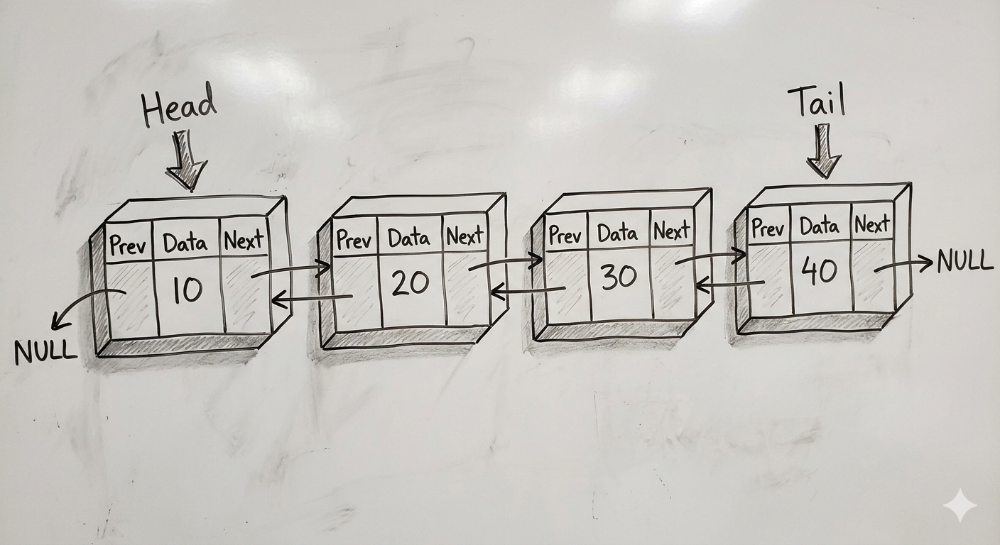

Introduction :
 
<h2>Doubly Linked List (DLL)</h2>
    
A Doubly Linked List (DLL) is a linear data structure in which:

    <ul>
        <li>Each element (node) contains:
            <ul>
                <li>Data</li>
                <li>A reference (pointer) to the next node</li>
                <li>A reference (pointer) to the previous node</li>
            </ul>
        </li>
        <li>The first node’s previous pointer is <strong>null</strong></li>
        <li>The last node’s next pointer is <strong>null</strong></li>
        <li>Traversal is possible in both directions (forward and backward)</li>
        <li>Memory is not contiguous</li>
        <li>Nodes are dynamically allocated and connected using two links</li>
    </ul>

Basic Structure :
 

<ol>
<li>
<strong>Advantages of a Doubly Linked List</strong>
     
<ul>
            <li>
                <strong>Bidirectional Traversal</strong>
                <ul>
                    <li>Each node has a pointer to both the next and previous nodes.</li>
                    <li>You can traverse the list forward or backward easily.</li>
                    <li>Example: Useful in browser history navigation or undo/redo operations.</li>
                </ul>
            </li>
            <li>
                <strong>Efficient Insertions and Deletions</strong>
                <ul>
                    <li>Insertions or deletions at any position (not just head or tail) can be done in O(1) time if you have a pointer to the node.</li>
                    <li>Unlike a singly linked list, you don’t need to traverse the list to find the previous node.</li>
                    </ul>
            </li>
            <li>
                <strong>Flexible for Complex Data Structures</strong>
                <ul>
                    <li>Doubly linked lists are often used to implement deques, stacks, and queues efficiently.</li>
                    <li>Also useful in adjacency lists in graph representations.</li>
                </ul>
            </li>
            <li>
                <strong>Easier Reverse Operations</strong>
                <ul>
                    <li>Reversing the list is simpler compared to singly linked lists because of the backward pointer.</li>
                </ul>
            </li>
        </ul>
</li>

<li>
    <strong>Drawbacks of a Doubly Linked List</strong>
     
<ul>
        <li>
            <strong>More Memory Usage</strong>
            <ul>
                <li>Each node stores two pointers instead of one, increasing memory usage.</li>
                <li>For large lists, this can be significant.</li>
            </ul>
        </li>
        <li>
            <strong>More Complex Implementation</strong>
            <ul>
                <li>Need careful handling of both next and previous pointers.</li>
                <li>Insertion, deletion, and traversal logic is more error-prone.</li>
            </ul>
        </li>
        <li>
            <strong>Slightly Slower Operations</strong>
            <ul>
                <li>The extra pointer management may make operations slightly slower than singly linked lists for simple tasks.</li>
            </ul>
        </li>
        <li>
            <strong>More Maintenance</strong>
            <ul>
                <li>Updating both pointers during insertion or deletion can lead to bugs like dangling pointers if not done correctly.</li>
            </ul>
        </li>
    </ul>
</li>
</ol>

